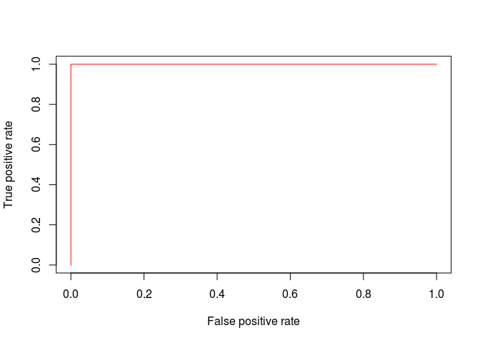

<!-- README.md is generated from README.Rmd. Please edit that file -->
Quick start
-----------

Welcome to the `exprso` GitHub page!

Supervised machine learning has an increasingly important role in biological studies. However, the sheer complexity of classification pipelines poses a significant barrier to the expert biologist unfamiliar with machine learning. Moreover, many biologists lack the time or technical skills necessary to establish their own pipelines. The `exprso` package introduces a framework for the rapid implementation of high-throughput supervised machine learning built with the biologist user in mind. Written by biologists, for biologists, `exprso` provides a user-friendly *R* interface that empowers investigators to execute state-of-the-art binary and multi-class classification, including deep learning, with minimal programming experience necessary. You can get started with `exprso` by installing the most up-to-date version of this package directly from GitHub.

``` r
library(devtools)
devtools::install_github("tpq/exprso")
library(exprso)
```

The `exprso` package organizes the myriad of methodological approaches to classification into analytical *modules* that provide the user with stackable and interchangeable data processing tools. Although this package primarily revolves around dichotomous (i.e., binary) classification, `exprso` also includes a rudimentary framework for multi-class classification. Some of the modules available include:

-   **array:** Modules that import data stored as a `data.frame`, `eSet`, or local file.
-   **mod:** Modules that modify the imported data prior to classification.
-   **split:** Modules that split these data into training and test sets.
-   **fs:** Modules that perform feature selection (e.g., statistical filters, SVM-RFE, mRMR, and more).
-   **build:** Modules that build classifiers (e.g, SVMs, artificial neural networks, random forests, and more).
-   **predict:** Modules that deploy classifiers and classifier ensembles.
-   **calc:** Modules that calculate classifier performance, including area under the ROC curve.
-   **pl:** Modules that manage elaborate classification pipelines (e.g., nested cross-validation, and more).
-   **pipe:** Modules that filter classification pipeline results.

### ALL/AML classification

To showcase this package, we make use of the publicly available hallmark Golub 1999 dataset to differentiate ALL (acute lymphocytic leukemia) from AML (acute myelogenous leukemia) based on gene expression as measured by microarray technology. We begin by importing this dataset from the package, `GolubEsets`, which exposes these data as an `eSet` (i.e., `ExpressionSet`) object. Then, using the `arrayExprs` function, we load the data into `exprso`. The `modFilter`, `modTransform`, and `modNormalize` functions allow us to replicate the pre-processing steps taken by the original investigators.

``` r
library(golubEsets)
data(Golub_Merge)
```

``` r
set.seed(12345)
array <- arrayExprs(Golub_Merge,
                    colBy = "ALL.AML",
                    include = list("ALL",
                                   "AML"))
```

``` r
array <- modFilter(array, 20, 16000, 500, 5)
array <- modTransform(array)
array <- modNormalize(array, c(1, 2))
```

In the next code chunk, we split the datasets randomly into training and test sets. Then, we perform feature selection on the training set by ranking features according to the results of a Student's *t*-test.

``` r
arrays <- splitSample(array, percent.include = 67)
array.train <- fsStats(arrays$array.train, top = 0, how = "t.test")
array.test <- arrays$array.valid
```

With the training set established, we can now build a classifier and deploy it on the test set. For this example, we will build a linear `kernel` support vector machine with minimal `cost`. We will build this classifier using the top 50 features as prioritized by `fsStats`.

``` r
mach <- buildSVM(array.train,
                 top = 50,
                 kernel = "linear",
                 cost = 1)
```

    ## Setting probability to TRUE (forced behavior, cannot override)...
    ## Setting cross to 0 (forced behavior, cannot override)...

``` r
pred <- predict(mach, array.train)
```

    ## Individual classifier performance:
    ## Arguments not provided in an ROCR AUC format. Calculating accuracy outside of ROCR...
    ## Classification confusion table:
    ##          actual
    ## predicted Control Case
    ##   Control      29    0
    ##   Case          0   19
    ##   acc sens spec
    ## 1   1    1    1

``` r
pred <- predict(mach, array.test)
```

    ## Individual classifier performance:
    ## Arguments not provided in an ROCR AUC format. Calculating accuracy outside of ROCR...
    ## Classification confusion table:
    ##          actual
    ## predicted Control Case
    ##   Control      18    0
    ##   Case          0    6
    ##   acc sens spec
    ## 1   1    1    1

``` r
calcStats(pred)
```

    ## Calculating accuracy using ROCR based on prediction probabilities...



    ##   acc sens spec auc
    ## 1   1    1    1   1

When constructing a classifier using **build** modules, we can only specify one set of parameters at a time. However, investigators often want to test models across a vast range of parameters. We provide the `plGrid` function for high-throughput parameter searches. This function wraps not only classifier construction, but deployment as well. By supplying a non-`NULL` argument to `fold`, this function will also calculate *v*-fold cross-validation using the training set.

``` r
pl <- plGrid(array.train,
             array.test,
             how = "buildSVM",
             top = c(5, 10, 25, 50),
             kernel = "linear",
             cost = 10^(-3:3),
             fold = NULL)
```

### Bootstrapping

What if we wanted to analyze multiple splits of a dataset simultaneously? This package provides a simple interface for executing Monte Carlo style bootstrapping, embedding **split**, **fs**, and **pl** modules all within a single wrapper. The `plMonteCarlo` function effectively iterates over the above modules (including `plGrid`) some number `B` times. Using this function requires custom argument handlers that help organize the **split**, **fs**, and **pl** methods, respectively.

``` r
ss <- ctrlSplitSet(func = "splitSample", percent.include = 67)
fs <- ctrlFeatureSelect(func = "fsStats", top = 0, how = "t.test")
gs <- ctrlGridSearch(func = "plGrid",
                     how = "buildSVM",
                     top = c(5, 10, 25, 50),
                     kernel = "linear",
                     cost = 10^(-3:3),
                     fold = NULL)
```

``` r
boot <- plMonteCarlo(array, B = 5,
                     ctrlSS = ss,
                     ctrlFS = fs,
                     ctrlGS = gs)
```

We refer you to the official vignette for a more comprehensive discussion of the `exprso` package, including an elaboration of the modules introduced here.

### References

1.  Golub, T.R., Slonim, D.K., Tamayo, P., Huard, C., Gaasenbeek, M., Mesirov, J.P., Coller, H., Loh, M.L., Downing, J.R., Caligiuri, M.A., et al. (1999). Molecular classification of cancer: class discovery and class prediction by gene expression monitoring. Science 286, 531-537.
