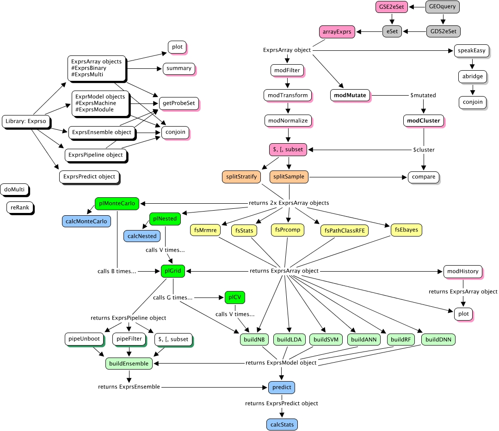

## Global package overview

```{r, echo = FALSE, out.width = '675pt', fig.retina = NULL}

```

## Available split methods

```{r, echo = FALSE}
df.split <- data.frame(
  
  "Method" = c("`splitSample`", "`splitStratify`"),
  "Data" = c(rep("Binary / Multi", 2)),
  "Notes" = c("Consider `replace = TRUE`", "Use `bin` and `breaks` to bin"),
  "Details" = c("See `stats::sample`", "See `base::cut`")
)

knitr::kable(df.split, format = "markdown")
```

## Available fs methods

```{r, echo = FALSE}
df.fs <- data.frame(
  
  "Method" = c("`fsSample`", "`fsNULL`", "`fsANOVA`", "`fsStats`", "`fsPrcomp`", "`fsPathClassRFE`", "`fsEbayes`", "`fsMrmre`"),
  "Data" = c(rep("Binary / Multi", 3), rep("Binary", 5)),
  "Notes" = c(rep("Default behavior", 3), "Use `how` to select test", rep("Default behavior", 4)),
  "Details" = c("See `stats::sample`", "No additional arguments", "See `stats::aov`", "See `stats::t.test` or `stats::ks.test`", "See `stats::prcomp`", "See `pathClass::fit.rfe`", "See `limma::ebayes`", "See `mRMRe::mRMR.classic`")
)

knitr::kable(df.fs, format = "markdown")
```

## Available build methods

```{r, echo = FALSE}
df.build <- data.frame(
  
  "Method" = c("`buildNB`", "`buildLDA`", "`buildSVM`", "`buildANN`", "`buildRF`", "`buildDNN`"),
  "Data" = rep("Binary / Multi", 6),
  "Notes" = c(rep("Default behavior", 5), "Clear RAM with `h2o::h2o.shutdown()`"),
  "Details" = c("See `e1071::naiveBayes`", "See `MASS::lda`", "See `e1071::svm`", "See `nnet::nnet`", "See `randomForest::randomForest`", "See `h2o::h2o.deeplearning`")
)

knitr::kable(df.build, format = "markdown")
```

## Available pl methods

```{r, echo = FALSE}
df.pl <- data.frame(
  
  "Method" = c("`plGrid`", "`plGridMulti`", "`plMonteCarlo`", "`plNested`"),
  "Data" = c("Binary / Multi", "Multi", rep("Binary / Multi", 2)),
  "Notes" = c("Uses `fold` for `plCV`", "Uses `ctrlFS`", "Uses `ctrlSS`, `ctrlFS`, and `ctrlGS`", "Uses `ctrlFS` and `ctrlGS`"),
  "Details" = c(rep("Validation set optional", 2), rep("Training set only", 2))
)

knitr::kable(df.pl, format = "markdown")
```
